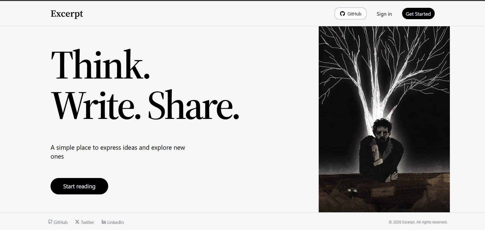

# _Excerpt_

_Excerpt_ refers to a short extract or preview from a larger piece of writing.

_Excerpt_ is a full stack blog platform inspired by Medium, built to explore modern backend architecture and modern web technologies.

## Live Demo

🔗 https://excerpt-blog.vercel.app

---

## Preview

<!-- Add screenshot or gif here -->



---

## Features

- JWT Authentication
- Password hashing with bcrypt
- Create and publish blogs
- Blog cover image uploads
- Cloudinary integration
- Responsive mobile-first UI
- Dynamic blog pages
- Loading skeletons
- Protected routes
- Publish dates and excerpts
- Clean modern design

---

# Tech Stack

## Frontend

- React
- TypeScript
- Tailwind CSS
- Axios

## Backend

- Hono
- Cloudflare Workers
- Prisma ORM
- PostgreSQL
- Zod
- JWT
- bcrypt

## Services

- Cloudinary
- Vercel

---

# What I Learned

This project helped me learn and work with:

- Cloudflare Workers
- Prisma ORM
- Authentication using JWT
- Password hashing using bcrypt
- Schema validation using Zod
- Responsive UI design
- Image uploads using Cloudinary
- Production deployment and debugging

---

# Local Setup

## Clone the repository

```bash
git clone https://github.com/yashveersinghh/excerpt.git
cd excerpt
```

# Install Dependencies

## Frontend

```bash
cd Frontend
npm install
```

## Backend

```bash
cd Backend
npm install
```

---

# Environment Variables

## Frontend `.env`

```env
VITE_BACKEND_URL=
VITE_CLOUDINARY_CLOUD_NAME=
VITE_CLOUDINARY_UPLOAD_PRESET=
```

## Backend `.env`

```env
DATABASE_URL=
JWT_SECRET=
```

---

# Run Locally

## Frontend

```bash
npm run dev
```

## Backend

```bash
npm run dev
```

---

# Deployment

## Frontend

Deployed on Vercel.

## Backend

Deployed using Cloudflare Workers.
